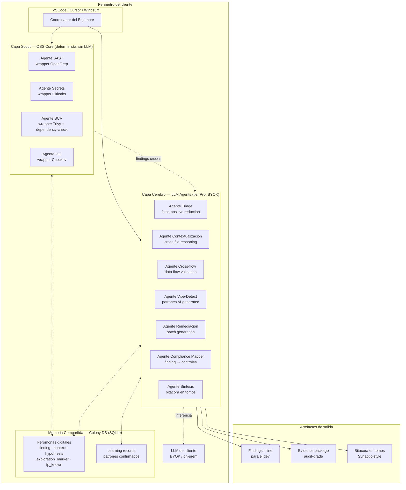
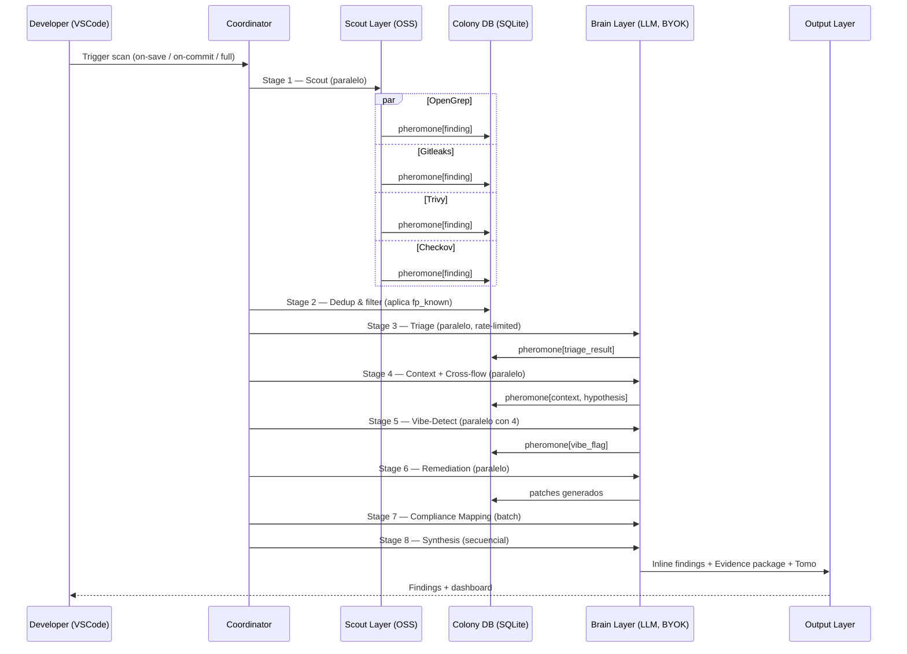
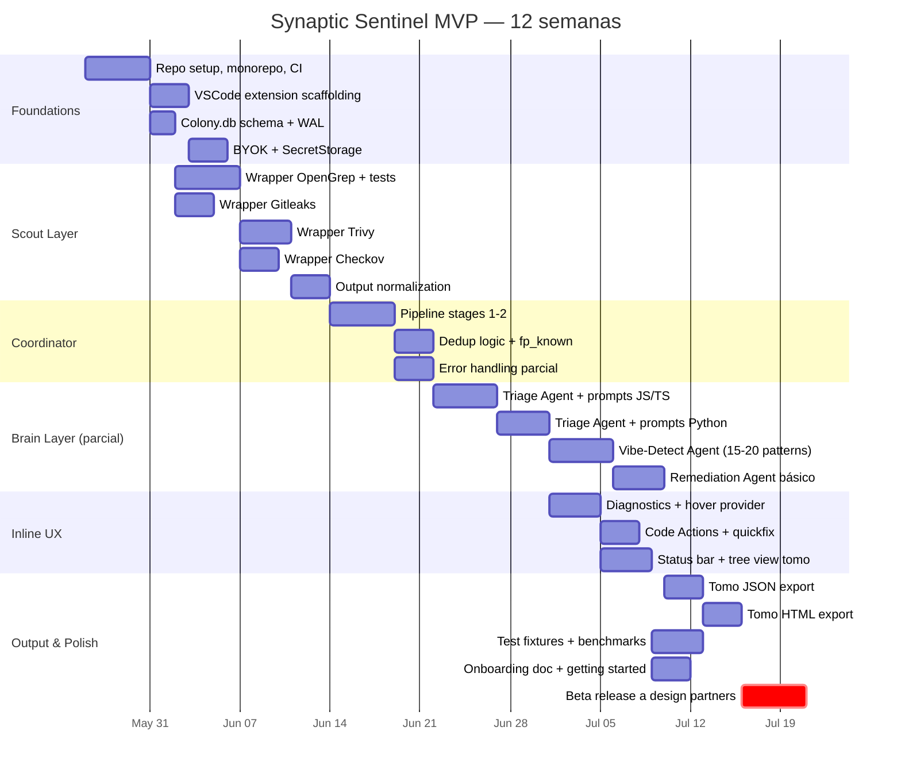

# Synaptic Sentinel — Documento Maestro v0.4

> **Sesión:** Planning estratégico, 20 de mayo de 2026
> **Autor:** Pedro A. Fernández Weigert (GoLab SpA), en sesión con Claude
> **Versiones:** v0.1 fundación → v0.2 estado del arte → v0.3 capa 3 (arquitectura) + naming → **v0.4 — capas 4 y 6 cerradas. Documento maestro completo.**
> **Estado:** **Capas 1, 2, 3, 4, 5 y 6 cerradas.** Listo para handoff a implementación.
> **Propósito:** Briefing maestro de contexto para Claude Code en VSC al iniciar implementación. Reúne todas las decisiones estratégicas, arquitectónicas y de go-to-market. NO es una especificación técnica detallada — los detalles de file structure, dependency tree y test strategy se construyen en discovery técnico al inicio de implementación.

---

## 0. Identidad del producto

**Nombre oficial:** **Synaptic Sentinel**

- Posición en la familia: tercer producto de la línea Synaptic, sibling de Synaptic Expert (governance) y conectado vía flywheel.
- Connotación: *sentinela* — postura defensiva, vigilante, audit-friendly. Encaja con el comprador regulado mejor que metáforas más agresivas.
- Compatibilidad con metáfora del enjambre: sostenida — las hormigas centinela son una casta real en las colonias, dedicadas a vigilancia perimetral.
- Identifiers técnicos: `synaptic-sentinel` para repo, paquete npm, extensión VSCode (`synaptic-sentinel.vsix`), namespace de configuración (`synaptic-sentinel.config.json`, `.synaptic-sentinel/`).

---

## 1. Visión

Synaptic Sentinel es un **toolkit OSS de auditoría agéntica de seguridad + capa premium de inteligencia LLM**, diseñado nativamente para la era de la *vibe-coding* — donde la mayor parte del código se genera con asistentes de IA (Claude Code, Cursor, Windsurf, Codex) y los equipos no tienen forma humana de auditarlo a la velocidad a la que se produce.

Vive en el IDE del desarrollador (VSCode primario; Cursor/Windsurf compatibles). Corre como un enjambre de agentes coordinados **dentro del perímetro del cliente** — el código nunca sale del entorno del cliente — y produce en paralelo:

1. **Findings inline** para el desarrollador mientras codifica.
2. **Evidence package audit-grade** para entregar a CISO/compliance/auditor cuando llega la auditoría.

**Filosofía de producto:** *developer-first, compliance-aware by design, vibe-coding-native.*

**Categoría Forrester (abril 2026):** Agentic Development Security (ADS). El producto nace en esta categoría, no pivota hacia ella.

**Tagline tentativa:** *"El centinela que audita lo que tu IA escribió — antes de que el auditor lo haga."*

---

## 2. Decisiones estratégicas tomadas

### 2.1 Modelo comercial
**OSS + tier comercial premium.** Core OSS construye adopción bottom-up y confianza técnica. Premium captura ingresos a través de capa de inteligencia LLM, dashboard web, on-prem, soporte SLA, integración GRC/SIEM, y compliance packages contra frameworks regionales (Ley 21.663, etc.).

### 2.2 Usuario primario (MVP)
**Desarrollador en industria regulada** (banca, salud, gobierno, infraestructura crítica), con foco específico en quien usa asistentes de IA y necesita auditar lo generado. **NO** el CISO directamente. CISO es comprador eventual del tier Pro; dev es quien instala, usa, y trae el producto.

### 2.3 Superficie principal
**Extensión VSCode**, con compatibilidad Cursor/Windsurf como objetivo cercano. Tier Pro incluirá dashboard web consolidado en fase 2.

### 2.4 Privacidad de código e inferencia LLM
**BYOK + on-prem opcional en Pro.** El código sensible nunca cruza el perímetro corporativo del cliente. Es un invariant arquitectónico.

### 2.5 Alcance de vulnerabilidades en MVP
**Cobertura amplia desde el MVP en superficie.** Categorías: SAST, Secrets, SCA, IaC, business-logic (vía agentes LLM), y AI-generated code red flags (categoría diferenciadora).

### 2.6 Arquitectura — **LOCKED** 🔒
**Híbrida.** *Orquestar el suelo, construir el techo.* Lock formal: 20 de mayo de 2026. Detalle completo en §3.

### 2.7 Stacks MVP — **LOCKED** 🔒
**JS/TS + Python** como foco de QA del brain layer. Otros lenguajes soportados best-effort vía OpenGrep en MVP; afinación lang-specific en fase 2.

---

## 3. Arquitectura y diseño del enjambre

### 3.1 Vista de sistema



### 3.2 Capa Scout — scanners OSS

| Tier | Scanner | Cubre | Licencia | Justificación |
|------|---------|-------|----------|---------------|
| **MVP** | **OpenGrep** | SAST multi-lenguaje | LGPL-2.1 | Mejor licencia y performance que Semgrep (3.22x). Cobertura nuclear. |
| **MVP** | **Gitleaks** | Secrets en código y commits | MIT | CLI trivial de wrappear, valor inmediato. |
| **MVP** | **Trivy** | SCA + IaC + containers + SBOM | Apache 2.0 | Multipropósito, respaldo Aqua, output JSON limpio. |
| **MVP** | **Checkov** | IaC específico (TF, K8s, CFN) | Apache 2.0 | Mejor que Trivy en TF avanzado; complementa. |
| Post-MVP | Bandit | Python-specific SAST | Apache 2.0 | Profundidad lang-specific. |
| Post-MVP | OWASP dependency-check | SCA Java/Maven | Apache 2.0 | Backup para ecosistema Java empresarial. |
| Post-MVP | ESLint security plugins | JS/TS lint-grade | MIT | Inline IDE feedback nativo. |
| Fase 2 | njsscan, govulncheck, etc. | Lang-specific deep | MIT/BSD | Cobertura long-tail. |

### 3.3 Por qué OpenGrep, no Semgrep

A fines de 2024, Semgrep movió cross-function taint analysis y otras features de su Community Edition a su tier comercial. En enero 2025, una coalición de 10+ AppSec startups (Aikido, Endor Labs, Jit, Arnica, Orca Security) forkeó la última CE completa creando **OpenGrep** (LGPL-2.1), reescrito en OCaml 5.3, mantenido por equipo full-time. Es ~3.22x más rápido que Semgrep, backward-compatible con reglas Semgrep, y restaura cross-function taint que Semgrep paywalleó.

### 3.4 Capa Cerebro — agentes LLM

Los agentes cerebro **no son microservicios ni procesos separados**. Son **prompts especializados que el Coordinator invoca**, cada uno con su template, su set de tools, y su schema de output. Implementación: TypeScript con SDK de Anthropic, BYOK del cliente.

| Agente | Input | Output | Trigger |
|--------|-------|--------|---------|
| **Triage Agent** | Finding crudo + código circundante (±30 líneas) | TP / FP / inconclusivo + confidence | Por cada finding del scout |
| **Context Agent** | Finding triaged + AST local | Explicación contextualizada (entrada, sink, exposición) | Solo TP del Triage |
| **Cross-flow Agent** | Finding contextualizado + repo map | Cadena de datos validada o refutada | TPs con potencial cross-file |
| **Vibe-Detect Agent** | Diff vs HEAD + commit metadata | Flags de patrones AI-generated | Por commit / on-save |
| **Remediation Agent** | Finding validado + contexto | Patch concreto (diff aplicable) | TPs confirmados |
| **Compliance Mapper** | Batch de findings validados | Mapping a controles regulatorios | Batch al final del scan |
| **Synthesis Agent** | Todos los outputs anteriores | Tomo narrativo estilo Synaptic | Una vez por scan completo |

### 3.5 Memoria compartida — las "feromonas digitales"

**Stack:** SQLite local en `.synaptic-sentinel/colony.db` dentro del proyecto del cliente, con WAL mode para lecturas concurrentes durante escrituras de agentes.

```sql
CREATE TABLE pheromones (
  id TEXT PRIMARY KEY,
  type TEXT NOT NULL,    -- finding | context | hypothesis | exploration_marker | fp_known
  agent_id TEXT NOT NULL,
  scan_id TEXT NOT NULL,
  target_path TEXT,
  payload JSON NOT NULL,
  confidence REAL,
  decay_rate REAL DEFAULT 0.1,
  created_at TIMESTAMP DEFAULT CURRENT_TIMESTAMP,
  expires_at TIMESTAMP
);
CREATE INDEX idx_pheromone_target ON pheromones(target_path, type);

CREATE TABLE scans (
  id TEXT PRIMARY KEY,
  started_at TIMESTAMP DEFAULT CURRENT_TIMESTAMP,
  finished_at TIMESTAMP,
  git_sha TEXT,
  agent_summary JSON
);

CREATE TABLE learning_records (
  id TEXT PRIMARY KEY,
  pattern_signature TEXT NOT NULL,
  classification TEXT NOT NULL,    -- fp_pattern | real_pattern | project_specific
  evidence_count INTEGER DEFAULT 1,
  last_seen_scan TEXT
);
```

### 3.6 Stigmergy concretizada — comportamientos observables y mensurables

1. **Pheromone-aware deduplication.** Triage Agent consulta `fp_known` antes de gastar tokens. En scans repetidos el costo LLM baja monotónicamente. **Métrica:** tokens consumidos por scan #N vs scan #1.
2. **Hypothesis propagation.** Context Agent deja feromonas `hypothesis` que invitan a Cross-flow Agent a investigar áreas específicas. **Métrica:** % de findings de alta severidad descubiertos por cascada vs barrido directo.
3. **Exploration markers con decay.** Áreas recorridas se marcan; el marker decae con cambios al archivo. **Métrica:** % de cobertura efectiva vs costo de scan completo.

### 3.7 Protocolo de coordinación



**Manejo de errores:** si un agente falla, el Coordinator continúa con los demás y marca el stage como parcial. Scan "degraded" > scan fallido.

### 3.8 Modos de scan

| Modo | Trigger | Stages | Tiempo | Costo LLM |
|------|---------|--------|--------|-----------|
| **On-save** | Archivo guardado | 1 (file), 2, 3 incremental | <5s | Bajísimo |
| **On-commit** | `git commit` / PR | 1 (diff), 2, 3, 4, 5 | ~30s | Medio |
| **Full scan** | Manual / CI | Todos | Minutos | Alto |
| **Background continuous (Pro)** | Configurable | Incremental periódico | Variable | Configurable |

### 3.9 Consideraciones técnicas

- **Rate-limiting LLM:** token bucket por BYOK key del cliente
- **SQLite WAL mode** para concurrencia
- **Chunking de contexto LLM:** priorizar líneas críticas, tools file_read on-demand
- **Cross-platform path handling:** normalizar a Unix internamente
- **BYOK key handling:** secure storage del SO (Keychain, Credential Manager, libsecret)
- **Telemetría:** opt-in explícito, anonimizada

---

## 4. Sistema de reportes y bitácora

### 4.1 Estructura del tomo (jerarquía bibliotecaria)

| Nivel | Concepto | Cardinalidad |
|-------|----------|--------------|
| **Biblioteca** | El proyecto del cliente entero | 1 por repo |
| **Tomo** | Una auditoría completa (full scan publicado) | N en el tiempo |
| **Capítulo** | Sección temática del tomo | ~5-8 por tomo |
| **Sección** | Subdivisión por scanner / categoría | Variable |
| **Finding** | Hallazgo individual con contexto completo | Hojas |

**Capítulos estándar del tomo:**

1. *Resumen Ejecutivo* — postura general, deltas vs tomo anterior, métricas clave
2. *Vulnerabilidades Críticas y Altas* — findings explotables que bloquean cumplimiento
3. *Hallazgos de Vibe-Coding* — output del Vibe-Detect Agent
4. *Configuraciones de Infraestructura* — IaC + containers + secrets
5. *Composición y Cadena de Suministro* — SCA + SBOM + deps vulnerables
6. *Mapeo de Cumplimiento* — findings × frameworks
7. *Remediación Sugerida* — patches generados con tracking
8. *Metodología y Trazabilidad* — qué scanners corrieron, qué modelo LLM, qué versiones

**Versionado:** cada tomo es immutable (snapshot del momento) con `git_sha` + `scan_id` + `timestamp` + `brain_model`. Hay un *tomo vivo* que se actualiza con on-save/on-commit, y se *publica* en eventos significativos (commit a `main`, merge PR, `synaptic-sentinel publish`).

**Cross-tomo learning:** la tabla `learning_records` mantiene patrones confirmados entre tomos sucesivos.

### 4.2 Evidence package — esquemas y formatos

**Cuatro formatos en paralelo desde un único modelo de datos:**

| Formato | Audiencia | Uso |
|---------|-----------|-----|
| **PDF** | Auditor humano / Compliance | Documento formal para GRC, regulador |
| **JSON** | Sistemas / Auditoría programática | Ingesta SIEM, GRC tools |
| **SARIF** | Tools del ecosistema | Standard MS/GitHub; integrable con GitHub Security, Azure DevOps |
| **HTML** | Stakeholder técnico interno | Navegable, links, copy-paste de patches |

**Esquema base:**

```json
{
  "metadata": {
    "tomo_id": "uuid",
    "biblioteca_id": "repo-fingerprint",
    "published_at": "ISO-8601",
    "git_sha": "commit-hash",
    "brain_model": "claude-opus-4-7",
    "sentinel_version": "0.x.y",
    "scope": { "paths": [...], "exclusions": [...] }
  },
  "executive_summary": {
    "posture_score": 0-100,
    "critical_count": N,
    "deltas_vs_last_tomo": {...},
    "compliance_status_per_framework": {...}
  },
  "findings": [
    {
      "id": "uuid",
      "severity": "critical|high|medium|low|info",
      "category": "SAST|Secrets|SCA|IaC|VibeCoded|BusinessLogic",
      "location": { "path": "...", "line": N, "snippet": "..." },
      "explanation": "...",
      "exploitability_path": "...",
      "remediation": { "diff": "...", "confidence": 0-1 },
      "compliance_refs": ["OWASP-A03", "CWE-89", "NIST-SSDF-PW.7", "Ley21663-X"],
      "lifecycle_state": "new|known|accepted_risk|remediated"
    }
  ],
  "compliance_mappings": {
    "OWASP_TOP_10_2021": { "covered_controls": [...], "gaps": [...] },
    "NIST_SSDF": {...},
    "ISO_27001_A14": {...},
    "Ley_21_663": {...},
    "OWASP_ASI_2026": {...}
  },
  "scan_methodology": {
    "scouts_run": [...], "agents_run": [...], "stages_completed": [...], "errors": [...]
  },
  "signature": {
    "hash": "sha256-of-canonical-form",
    "signed_by": "BYOK-account-id|on-prem-instance-id"
  }
}
```

**Firma del paquete:** SHA-256 del canonical form en todos los tiers. **Firma digital (ed25519 o X.509) en Pro Team y Enterprise** — útil para auditorías formales donde se requiere prueba de no-manipulación.

### 4.3 UX de findings inline en VSCode

**APIs a usar:**

| API | Propósito |
|-----|-----------|
| `vscode.DiagnosticCollection` | Findings en Problems panel + squiggles inline |
| `vscode.languages.registerHoverProvider` | Hover cards con contexto + remediation |
| `vscode.languages.registerCodeActionsProvider` | "Apply fix" / "Mark as FP" / "Open in tomo" / "Accept as known risk" |
| `vscode.window.createTextEditorDecorationType` | Gutter icons por severidad |
| `vscode.window.createStatusBarItem` | Estado del scan + contador críticos |
| `vscode.window.registerWebviewViewProvider` | Panel lateral con el tomo vivo |
| `vscode.window.createTreeView` | Explorer del tomo (capítulos > secciones > findings) |

**Iconografía de severidad:**

- Critical → ●  rojo + sugerencia de bloqueo en CI
- High → ◆  naranja
- Medium → ▲  amarillo
- Low → ■  azul
- Info / Vibe-flag → ◯ gris/celeste

**Anatomía del hover card:**

```
[CRITICAL] SQL Injection (CWE-89)
─────────────────────────────────
Tipo: Validated by Cross-flow Agent
Confianza: 0.94

Esta inyección es explotable: req.params.id llega sin
sanitizar desde un endpoint público y termina en
db.query() sin parametrización.

Mapeo: OWASP A03 · CWE-89 · NIST SSDF PW.7 · Ley 21.663

[Apply suggested fix]  [Why is this real?]
[False positive]       [Accept as known risk]
[Open in tomo]
```

**Status bar:** `◐ Sentinel: 2C 5H 12M · Scan: ready · Brain: idle · $0.04` (último valor = costo LLM acumulado de la sesión cuando BYOK).

### 4.4 Dashboard web Pro (fase 2)

Componentes:

- **Overview de postura** por proyecto: scoring, trends, deltas
- **Compliance posture** por framework seleccionado (semáforo)
- **Audit trail**: historial completo de tomos publicados, quién aprobó/aceptó cada finding, evidencia firmada
- **Team & Role views**: developer / security lead / compliance officer / CISO ven distinto
- **Export on-demand**: regenerar evidence package en cualquier formato
- **Integraciones**: webhooks Slack/Teams, Jira tickets, GRC sync (ServiceNow, Archer)
- **Anonymized benchmarking** (opt-in): postura vs promedio del cuadrante

**Stack candidato (validar en discovery):** Next.js + Supabase (paralelismo con MediTrace), Vercel para deploy, Cloudflare para edge/cache. Para on-prem: Docker Compose o Helm chart con PostgreSQL self-hosted.

### 4.5 Sistema de notificaciones

| Disparador | Canal | Tier |
|------------|-------|------|
| Critical finding en archivo abierto | VSCode toast (+ sound opcional) | OSS |
| Scan completado | VSCode toast | OSS |
| Critical finding en repo (background) | Slack/Teams webhook | Pro |
| CVE nuevo en dependencia ya escaneada | Real-time alert | Pro |
| Postura mensual de cumplimiento | Email digest | Pro |
| Drift de configuración IaC | Alert configurable | Pro |

---

## 5. Herencia de Synaptic Expert

- **Bitácora en tomos** — estructura jerárquica del Synthesis Agent
- **Registros de aprendizaje** — `learning_records` table cross-scan
- **EnforcementBridge pattern** — separación scout (detección) / cerebro (juicio)
- **Confidence scoring + temporal decay** — feromonas con `confidence` y `decay_rate`
- **Learning Contradiction Detector** — feromonas contradictorias en mismo `target_path` se detectan y escalan

**Referencia:** revisar `@synaptic-sre/enforcement` (`ResponseValidator`, `TemplateChecker`, `ComplianceScorer`, `RegenerationEngine`).

---

## 6. Frameworks de compliance objetivo

**AppSec tradicionales:** OWASP Top 10 (2021), OWASP ASVS, CWE Top 25, NIST SSDF (SP 800-218), ISO 27001/27002 (A.14), PCI-DSS, HIPAA, CIS Controls v8, SOC 2 Type II.

**Agentic / IA (nuevos 2025-2026):**

- **OWASP Top 10 for Agentic Applications 2026** (ASI01-ASI10) — publicado diciembre 2025
- OWASP Top 10 for LLM Applications
- **Forrester ADS** (Agentic Development Security) — categoría abril 2026
- **Forrester AEGIS** — Agentic AI Guardrails for Information Security
- EU AI Act — high-risk obligations vigentes desde agosto 2026
- Colorado AI Act — vigente desde junio 2026
- NIST AI RMF

**LATAM (diferenciador regional):**

- **Ley 21.663 (Chile)** — Marco de Ciberseguridad, ANCI operativa, multas hasta 40.000 UTM, reporte 3h para PSE
- **Ley 21.719 (Chile)** — Protección de Datos, vigencia plena diciembre 2026, notificación 72h
- **CMF Chile** — continuidad operacional y ciberseguridad banca/fintech
- Frameworks equivalentes LATAM (mapear progresivamente)

---

## 7. Cuadrante competitivo y diferenciación

**Categoría Forrester:** Agentic Development Security (ADS). Wave report pendiente.

**Competidores directos:**

| Player | Posición | Nota |
|--------|----------|------|
| **ZeroPath** | AI-native SAST con razonamiento semántico | Top 10 finalista RSAC 2026 Innovation Sandbox |
| **Corgea** | AI-driven triage + remediation | ~3x reducción FPs vs SAST tradicional |
| **Aikido Security** | Full-stack dev-first AppSec | 25-50k orgs; wrappea OpenGrep |
| **Checkmarx One Assist** | Enterprise agentic AppSec | 3 agentes: Developer/Policy/Insights |
| **Black Duck Signal** | Agentic AppSec para código AI | Lanzado RSAC 2026 |
| **DryRun Security** | PR-native code policy enforcement | Foco en Claude Code, Cursor, Codex |
| **Snyk** | Plataforma broad parcialmente dev-first | ML + semantic |
| **GitHub Advanced Security** | CodeQL + Copilot security | Integración nativa GitHub |
| **Pixee, Almanax** | AI security engineers | Auto-fix, IDE-integrated |
| **Anthropic Claude Code** | `security-review` command | Básico; sin state ni gestión de findings |

**Vectores de diferenciación de Synaptic Sentinel:**

1. **Vibe-coding-native AppSec** — diseñado nativamente para auditar código generado por agentes de IA. Posicionamiento más fuerte dado el surge de CVEs por IA (6 → 35 en Q1 2026).
2. **LATAM/Spanish-first** — UI, documentación, compliance mapping a Ley 21.663, 21.719, CMF, marcos LATAM. White space sin competencia directa.
3. **Integración Synaptic Expert** — flywheel governance + security en el mismo IDE.
4. **Privacy-first by architecture** — BYOK + on-prem desde MVP combinado con LATAM-regulado.
5. **Evidence package compliance-grade** — paquete listo-para-auditor mapeado a frameworks.
6. **Stigmergy genuina en el enjambre** — tres comportamientos observables y mensurables (§3.6).

> "OSS scanners + LLM intelligence layer" ya es table stakes en 2026. El diferenciador NO es la combinación; es lo que se hace con ella + el posicionamiento.

---

## 8. Roadmap, MVP y Go-to-Market

### 8.1 Definición de "Done" para MVP

**El MVP está terminado cuando un design partner puede instalarlo, configurarlo, escanear su codebase real, recibir findings útiles, y exportar un tomo en JSON+HTML para mostrar a su CISO** — todo sin intervención manual del founder.

**Must-have:**

- VSCode extension instalable desde marketplace o `.vsix`
- 4 scouts wrappeados (OpenGrep, Gitleaks, Trivy, Checkov) funcionando en JS/TS + Python
- Coordinator corriendo stages 1, 2 y 3 (scout, dedup, triage) con manejo de errores parcial
- BYOK configurable vía VSCode SecretStorage
- Findings inline con squiggles, hover cards básicas, Problems panel
- Tomo exportable a JSON y HTML
- Colony.db con schema completo
- Documentación de instalación y configuración para devs

**Should-have:**

- Remediation Agent generando patches simples
- Vibe-Detect Agent calibrado para ~15-20 patrones más comunes en JS/TS + Python
- Code Action "Apply fix" funcional
- Compliance mapping para OWASP Top 10 (base)
- SARIF export
- Status bar item

**Out of MVP (Fase 2):**

- Dashboard web Pro
- On-prem packaging
- Cross-flow Agent
- Multi-framework compliance mapping (LATAM, ASI 2026, NIST SSDF)
- Background continuous scans
- Slack/Teams/Jira integrations
- Firma digital del evidence package
- Synthesis Agent (tomo narrativo elaborado)

### 8.2 Plan de hitos a 12 semanas



Critical path: capa cerebro (semanas 6-10). Scout layer y UX trabajan en paralelo. Pull-forward posible: capa scout funcional con findings inline básicos (semana 6) permite empezar conversaciones con design partners antes de tener cerebro completo.

### 8.3 Estrategia de design partners

**Target:** 3-5 design partners en LATAM regulado.

**Perfil ideal:**

- CTO o Tech Lead en fintech, healthtech, govtech, e-commerce regulado
- 10-50 desarrolladores
- Ya usando Claude Code, Cursor, Copilot o similar
- Localización: Chile primero, luego Argentina, México, Colombia, Perú
- Idealmente con auditoría externa programada en 6-12 meses (urgencia natural)

**Lo que ofreces:**

- 12+ meses de Pro gratis
- Línea directa con el founder (Pedro)
- Custom compliance mappings para sus frameworks específicos
- Co-creación de patterns Vibe-Detect para su stack
- Pricing locked-in a tarifa de design partner para siempre
- Mención prioritaria en case studies y conferencias

**Lo que les pides:**

- Acceso a codebase real para testing y calibración
- Sesión de feedback semanal de 30 minutos
- Testimonio público (logo + quote) cuando estén satisfechos
- Referencia para sales calls
- Case study (puede ser anonimizado)

**Canales de adquisición priorizados:**

1. Red existente de GoLab en Chile (warmest)
2. Usuarios de Synaptic Expert (overlap natural)
3. LinkedIn outreach targeteado nominal
4. Comunidades LATAM AppSec: Ekoparty (Argentina), 8.8 Computer Security Conference (Chile), DragonJAR (Colombia)
5. Newsletter / blog post anunciando el design partner program con formulario corto y selectivo

### 8.4 Plan de open-sourcing

**Qué va al OSS (Apache 2.0):**

- Coordinator y pipeline orchestration
- Scout Layer completo (wrappers OpenGrep, Gitleaks, Trivy, Checkov)
- Colony.db schema y queries
- CLI básico
- VSCode extension shell con UX inline para findings scout-only
- JSON y SARIF export
- Sistema de configuración
- Documentación completa
- Test fixtures + benchmarks

**Qué se queda Pro (EULA comercial bajo Ley 17.336):**

- Todos los agentes del Brain Layer (Triage, Context, Cross-flow, Vibe-Detect, Remediation, Compliance Mapper, Synthesis)
- Prompt libraries afinadas
- Compliance framework mappings (especialmente LATAM)
- HTML export elaborado + PDF
- Dashboard web
- On-prem packaging
- Integraciones Slack/Teams/Jira/GRC
- Background continuous scans
- Firma digital del evidence package
- Enterprise features (SSO, audit log, RBAC)

**Timing:** desarrollo privado hasta MVP listo, luego OSS y Pro lanzan **simultáneamente**. Permite pulir antes de exposición pública, evita el "OSS abandonado", crea momentum.

**Detalles legales:**

- Licencia OSS: **Apache 2.0** (el patent grant es relevante en AppSec)
- EULA Pro: custom bajo Ley 17.336 (consistente con Synaptic Expert)
- **DCO** (Developer Certificate of Origin) para contribuciones
- **CLA** opcional recomendado para preservar opcionalidad de relicensing

### 8.5 Community-building

**Canales:** GitHub Discussions (forum principal) · Discord (síncrono, bilingüe) · LinkedIn (B2B/CISO) · Twitter/X (anuncios) · YouTube (tutorials, webinars).

**Estrategia de contenido (primeros 6 meses):**

- Serie de blog posts sobre la crisis de vibe-coding
- Reporte mensual "Estado de la Vibe-Coding Security" con data anonimizada de Vibe-Detect — contenido que se viraliza solo y nadie más puede producir
- Webinars en español para LATAM AppSec
- Talks: postular Ekoparty (julio 2026), 8.8, DragonJAR
- Aplicación a **RSAC 2027 Innovation Sandbox** — apuntar al mismo escenario donde estuvo ZeroPath este año

**Estrategia de idioma:**

- Documentación técnica: inglés primero + español traducido
- Marketing comercial: español primero para LATAM, inglés secundario
- Discord: bilingüe desde el día uno

### 8.6 Pricing — **LOCKED** 🔒: Tiered platform

| Tier | Precio (USD) | Límites | Features clave |
|------|--------------|---------|----------------|
| **Sentinel Core** | Gratis (OSS Apache 2.0) | Ilimitado | Scout layer completo, findings inline básicos, JSON/SARIF export, CLI |
| **Sentinel Pro Starter** | $99/mes | 3 repos, 5 devs | + Brain layer, OWASP/CWE mapping, HTML export, soporte email |
| **Sentinel Pro Team** | $499/mes | 25 repos, 25 devs | + Todos los frameworks compliance, PDF firmado, integraciones Slack/Teams, soporte priority |
| **Sentinel Pro Enterprise** | Custom desde $2.5K/mes | Ilimitado | + On-prem, SSO, RBAC, audit log, CSM dedicado, integraciones GRC |

**Ajuste regional LATAM:** ~50% del precio USD ajustado por paridad de poder adquisitivo. Starter ≈ $50, Team ≈ $250, Enterprise custom.

**Design partner pricing:** locked-in al ~30% del precio Pro Team para siempre como benefit perpetuo.

---

## 9. Notas para Claude Code al iniciar implementación

1. **Decisiones LOCKEADAS — no re-validar al implementar:**
   - Nombre: Synaptic Sentinel
   - Arquitectura: híbrida (scout OSS + cerebro LLM + colony.db)
   - Wrap OpenGrep, NO Semgrep
   - BYOK invariant — código del cliente nunca cruza su perímetro
   - Coordinator en TypeScript, agentes cerebro como prompts especializados (no microservicios)
   - SQLite local para colony.db con WAL mode
   - Pipeline secuencial con paralelismo intra-stage
   - JS/TS + Python afinados en MVP; otros lenguajes best-effort
   - OSS Apache 2.0 + Pro EULA bajo Ley 17.336
   - Pricing tiered platform Core/Starter/Team/Enterprise

2. **Identificadores del proyecto:**
   - Repo: `synaptic-sentinel` (público OSS) + `synaptic-sentinel-pro` (privado)
   - NPM scope: `@synaptic-sentinel/*`
   - VSCode extension: `synaptic-sentinel.vsix`
   - Config del cliente: `.synaptic-sentinel/` + `synaptic-sentinel.config.json`
   - DB de feromonas: `.synaptic-sentinel/colony.db`

3. **Invariant inviolable:** el código del cliente NO cruza su perímetro. Cualquier diseño que requiera upload a backend de GoLab está mal diseñado.

4. **Stack de partida sugerido (validar en discovery):**
   - TypeScript (consistente con Synaptic Expert)
   - Node.js 20+
   - VSCode Extension API
   - `child_process` para invocar scanners OSS
   - `better-sqlite3` para colony.db (synchronous-friendly, mejor performance que `sqlite3`)
   - `@anthropic-ai/sdk` para capa cerebro con BYOK
   - `vscode.SecretStorage` para BYOK key
   - `zod` para schemas de validación
   - `simple-git` para git ops
   - Vitest para tests

5. **Estructura de monorepo:** decidir en discovery entre Turborepo, Nx, pnpm workspaces. Probable preferencia: pnpm workspaces (simple, sin overhead).

6. **Eat your own dogfood (OWASP ASI 2026):** Sentinel es una aplicación agéntica y debe cumplir OWASP Top 10 for Agentic Applications:
   - **Least Agency** — Coordinator solo invoca agentes según pipeline, no delegación libre
   - **Memory Poisoning** — feromonas tienen `agent_id` y `scan_id` para trazabilidad; validar payloads contra schema (zod)
   - **Tool Misuse** — scout agents sin acceso de red ni filesystem fuera del proyecto cliente
   - **Sandboxing** — scout agents corren como child processes con límites de recursos
   - **Rogue Agents** — agentes con kill-switch en el Coordinator si exceden tiempo o tokens budget

7. **Licencias de dependencias OSS wrappeadas:**
   - OpenGrep — LGPL-2.1 (child process, no linking → compatible)
   - Trivy — Apache 2.0
   - Gitleaks — MIT
   - Bandit — Apache 2.0
   - Checkov — Apache 2.0

8. **Ecosistema Synaptic:** revisar `@synaptic-sre/enforcement` (`ResponseValidator`, `TemplateChecker`, `ComplianceScorer`, `RegenerationEngine`) antes de partir desde cero. Patrones reutilizables.

9. **MVP scope explícito (§8.1):** los "should-have" se construyen DESPUÉS de los "must-have", no antes. Resistir el impulso de agregar features tempranas.

10. **Onboarding del primer design partner debería ser posible en <30 minutos** desde el `.vsix` instalado. Diseñar la UX con esto en mente.

---

## Apéndice A — historial completo de decisiones

| #  | Capa          | Decisión                                              | Rationale                                                            |
|----|---------------|-------------------------------------------------------|----------------------------------------------------------------------|
| 1  | Comercial     | OSS + premium                                         | Trust + adopción bottom-up con upsell enterprise                     |
| 2  | Usuario       | Dev en regulado (no CISO)                             | Resuelve tensión surface VSCode-vs-CISO                              |
| 3  | Surface       | VSCode primario, multi-superficie en Pro              | Coherente con Synaptic Expert; dashboard web en fase 2               |
| 4  | Privacy       | BYOK + on-prem opcional                               | Mandatorio para regulado; elimina data residency                     |
| 5  | Scope         | Cobertura amplia desde MVP                            | Músculo del enjambre coordinado como diferenciador                   |
| 6  | Arquitectura  | Híbrido recomendado                                   | Velocidad MVP, IP defensible, tiering natural                        |
| 7  | Estado del arte | Búsqueda exhaustiva mayo 2026                       | Validó arquitectura, agregó vibe-coding como vector #1               |
| 8  | OSS layer     | OpenGrep en vez de Semgrep                            | Mejor licencia, performance, respaldo de coalición                   |
| 9  | Compliance    | + OWASP ASI 2026, ADS, AEGIS, EU AI Act, Ley 21.663/21.719 | Frameworks vigentes y emergentes 2026                          |
| 10 | Posicionamiento | Vibe-coding-native + LATAM-regulado                 | Combinación de demanda activa sin competencia directa                |
| 11 | **Arquitectura** | **LOCK formal arquitectura híbrida**             | **Validada por research; lock 20-may-2026**                          |
| 12 | **Naming**    | **Synaptic Sentinel**                                 | **Postura defensiva audit-friendly, coherente con familia Synaptic** |
| 13 | Scout layer   | OpenGrep + Gitleaks + Trivy + Checkov MVP             | Cobertura ~80% con 4 herramientas, licencias compatibles             |
| 14 | Brain layer   | 7 agentes especializados (prompts + tools)            | Calidad por tarea, debugging simple, no microservicios               |
| 15 | Shared memory | SQLite + pheromone schema en `.synaptic-sentinel/colony.db` | Embedded, cross-platform, queryable, WAL mode                  |
| 16 | Stigmergy     | 3 comportamientos observables (dedup, propagation, decay) | Justifica el relato del enjambre con métricas reales             |
| 17 | Coordination  | Pipeline stages con paralelismo intra-stage           | Simple, testeable, no broker                                         |
| 18 | Scan modes    | on-save / on-commit / full / background-continuous    | Cubre dev workflow + CI + premium                                    |
| 19 | MVP languages | **JS/TS + Python LOCKED**                             | Heavyweights de vibe-coding, mercado regulado LATAM                  |
| 20 | Reportes      | Tomo jerárquico (Biblioteca/Tomo/Capítulo/Sección/Finding) | Heredado y extendido de Synaptic Expert                         |
| 21 | Evidence pkg  | Multi-formato: PDF, JSON, SARIF, HTML                 | Cubre auditor humano + sistemas + tools ecosistema + interno         |
| 22 | Firma         | SHA-256 todos los tiers; digital ed25519/X.509 en Pro | Audit trail formal para regulado                                     |
| 23 | UX inline     | VSCode APIs nativas (diagnostics, hover, actions, status, tree) | Integración profunda en lugar de UI custom               |
| 24 | Dashboard     | Next.js + Supabase candidato (fase 2)                 | Paralelismo con MediTrace para economía de aprendizaje               |
| 25 | Notificaciones | Toast OSS + webhooks Slack/Teams Pro                 | Bajo costo, alto valor                                               |
| 26 | MVP scope     | Must-have / Should-have / Out-of-MVP explícito        | Disciplina contra scope creep                                        |
| 27 | Roadmap       | 12 semanas con critical path en brain layer           | Plazo agresivo pero realista para solo founder                       |
| 28 | Design partners | 3-5 LATAM regulado, Chile primero, con benefits perpetuos | Calidad sobre cantidad; trust local                            |
| 29 | Open-sourcing | Apache 2.0 core + EULA Pro Ley 17.336; lanzamiento simultáneo | Pulido antes de exposición pública; evita OSS abandonado     |
| 30 | Community     | Bilingüe (EN tech / ES marketing), GitHub Discussions + Discord | LATAM commercial + global OSS                              |
| 31 | **Pricing**   | **Tiered platform LOCKED — Core gratis / Starter $99 / Team $499 / Enterprise $2.5K+** | **Entrada baja + upgrade path claro + ajuste regional LATAM** |

---

## Apéndice B — datos de mercado clave (mayo 2026)

**Crisis de la vibe-coding:**

- 45% del código generado por IA introduce vulnerabilidades OWASP Top 10 (Veracode, mar 2026)
- CVEs atribuidas a código AI: 6 (ene) → 15 (feb) → 35 (mar) 2026 — Georgia Tech Vibe Security Radar
- 91.5% de vibe-coded apps con al menos una vuln por hallucination en Q1 2026
- 2.74x más fallos en código AI vs humano (470 GitHub PRs)
- Java tiene 72% tasa de fallo en código AI-generated — segmento de oportunidad para fase 2
- De 74 CVEs confirmados por AI: Claude Code 27, GitHub Copilot 4, Devin 2

**Mercado LATAM/Chile:**

- Multas Ley 21.663 hasta 40.000 UTM (~$2.5M USD)
- 78% de organizaciones chilenas priorizarán ciberseguridad en 2026
- >50% de directorios chilenos desconocen requisitos de la Ley 21.663 (ManpowerGroup)
- Ley 21.719 (datos personales) vigencia plena diciembre 2026 — segunda ola

**Movimiento de incumbentes (RSAC 2026, marzo):**

- ZeroPath: Top 10 finalista Innovation Sandbox
- Checkmarx: lanza One Assist (3 agentes)
- Black Duck: lanza Signal (agentic AppSec)
- Cisco: lanza AI Defense Explorer Edition
- Microsoft: lanza Agent Governance Toolkit (OSS, MIT)
- Forrester: define ADS como categoría

**Cambio OSS:**

- Semgrep paywalleó cross-function taint en fines 2024
- OpenGrep forkeado enero 2025 por coalición (Aikido, Endor Labs, Jit, Orca, Arnica)
- OpenGrep: LGPL-2.1, OCaml 5.3, 3.22x faster, full taint analysis restored

---

**Estado final:** Las seis capas (visión, decisiones estratégicas, arquitectura, reportes, frameworks, GTM) están cerradas. Synaptic Sentinel tiene definición producto-arquitectónica-comercial suficiente para iniciar implementación. Próximo paso: handoff a Claude Code para discovery técnico y scaffolding del repo `synaptic-sentinel`.
